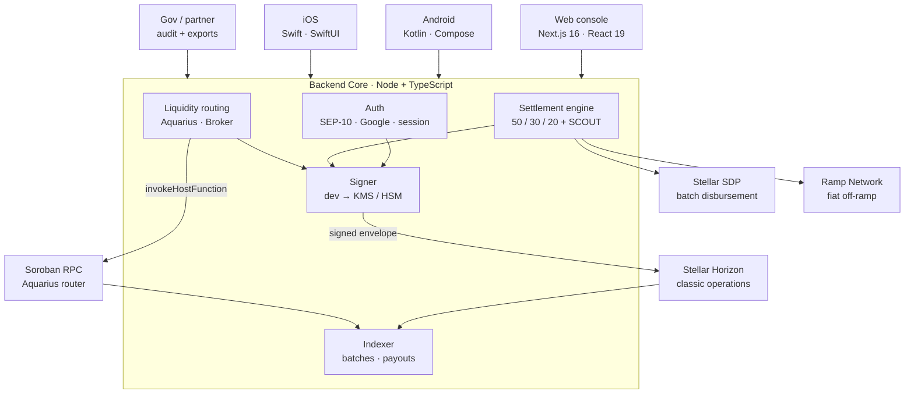

<div align="center">

<picture>
  <source media="(prefers-color-scheme: dark)" srcset="web/public/8.png">
  
</picture>

# PathPulse

### Settlement, made verifiable.

*Revenue arrives once. A deterministic 50 / 30 / 20 split is computed, weighted by on-chain reputation, and settled as a single Stellar transaction that a partner, an auditor, or a government can verify on Horizon — without taking anyone's word for it.*

[](https://stellar.org)
[](https://www.typescriptlang.org/)
[](https://nextjs.org)
[](https://react.dev)
[](https://developer.android.com/jetpack/compose)
[](https://developer.apple.com/swiftui/)
[](https://aqua.network)
[](https://github.com/stellar/stellar-disbursement-platform-backend)

[**Architecture**](docs/ARCHITECTURE.md) · [**API contract**](docs/API_ARCHITECTURE.md) · [**Phase plan**](docs/PHASE_PLAN.md) · [**Changelog**](CHANGELOG.md)

</div>

---

## What is PathPulse?

Institutional reward programmes have the same failure mode everywhere: money goes in one end, recipients are told what came out the other, and the arithmetic in between is a spreadsheet nobody outside the operator can inspect. Disputes are unanswerable because there is nothing to check.

PathPulse makes the arithmetic the ledger. A settlement batch computes its split deterministically, applies each contributor's on-chain reputation multiplier, and lands as **one multi-operation Stellar transaction**. The split is not reported — it is executed. Anyone holding the transaction hash can reconstruct the entire distribution, from treasury deposit down to an individual payout.

> **Why the split is on-chain.** An off-chain split is a claim; an on-chain split is a receipt. Once the 50 / 30 / 20 is a transaction rather than a row in a database, the operator loses the ability to quietly restate it, and the recipient gains the ability to verify it without asking. That asymmetry is the entire product.

**One shared backend. Three thin clients.** Treasury signing, payout orchestration, the settlement engine and asset issuance all require trusted authority and private keys — none of which can live in a mobile binary. They run in one service; the apps render it and stay behaviourally identical because they consume the same OpenAPI contract.

---

## Features

### Accounts & custody
- **Protocol-governed distribution accounts** — Partner Revenue, Driver Pool and Treasury are provisioned as distinct on-chain accounts, so every flow of funds has a named, auditable origin and destination.
- **Multisig treasury** — the treasury carries a signer set with a ≥ 2-of-3 threshold. The configuration transaction is *built* by the backend and handed to a human to review and sign; the service never auto-provisions its own signer set.
- **Human-gated signing** — the `Signer` interface abstracts dev keypairs from KMS- and HSM-backed production signing. The dev signer refuses mainnet outright, so no code path can produce a mainnet signature without an explicit, gated backend.
- **Delegated transaction construction** — clients describe intent (`payment`, `createAccount`, `changeTrust`); the backend builds, signs and submits. The client never holds a key.

### Identity & wallet interop
- **Non-custodial sign-in via SEP-10** — the wallet proves account ownership by signing a challenge transaction. Freighter, Lobstr, xBull and Albedo are wired through Stellar Wallets Kit.
- **Custodial sign-in via Google** — Google Identity Services returns an ID token, verified server-side against the client ID; no OAuth secret is ever needed or stored.
- **Guest sessions** — the console is explorable without an account, so a reviewer can inspect settlement traceability before committing to a wallet.
- **httpOnly session cookies** — session identity is server-verified and signed; the browser never holds a bearer token it could leak.

### Settlement engine
- **Deterministic 50 / 30 / 20** — Authorities, Driver Rewards, Treasury. Computed in integer stroops, never floating point, so the split is exact and reproducible.
- **One transaction per batch** — every leg of a distribution is an operation in a single envelope. The batch either settles atomically or does not settle at all; no partial payouts to reconcile.
- **Reputation-weighted rewards** — the driver pool is divided by SCOUT tier weight, so a contributor's multiplier changes their share of the pool without changing the pool.
- **Source → Split → Driver drill-down** — an indexer surfaces each batch as a traversable tree, from the funding account through the three-way split down to individual payouts, each linking out to Stellar Expert.
- **Group payouts** — upload a CSV or Excel sheet of name / address / amount and pay every recipient exactly, with no split or tier logic, for cases that aren't revenue distribution. Addresses are validated before a transaction is built.

### SCOUT reputation
- **Tiers as Classic Assets** — SCOUT1 / SCOUT2 / SCOUT3 are issued assets carrying `AUTH_REQUIRED`, `AUTH_REVOCABLE` and `AUTH_CLAWBACK`, so a badge is granted, auditable, and revocable by the issuer.
- **Reward multipliers of 1.0× / 1.2× / 1.5×** — read from the chain at settlement time, not from application state. The badge is the source of truth.
- **Score-driven assignment** — a PulseGen validation score maps to a tier; the issuer authorizes the trustline and delivers the badge in a single issuer-signed transaction.

### Liquidity routing
- **Aquarius AMM path-finding** — quotes route across Aquarius' pool graph, chaining up to four pools, and return the full hop path alongside the estimate.
- **Router contract execution** — the returned swap chain is executed through the Aquarius router via Soroban `invokeHostFunction`, with a slippage floor enforced on-chain rather than trusted from the client.
- **Live quotes with slippage bounds** — every quote carries destination amount, minimum received, tolerance in basis points and the readable route, so an operator sees the cost of a conversion before committing.
- **Trustline preflight** — a destination without the required trustline is named as an actionable error instead of failing opaquely mid-swap.
- **Multi-source routing** — Stellar Broker sits alongside Aquarius as a second liquidity source, aggregating Stellar DEX, classic AMMs and Soroswap for best-execution comparison.

### Payout rails & off-ramp
- **SDP batch disbursements** — settlement batches hand off to the Stellar Disbursement Platform for orchestrated, receipted bulk payout with per-recipient status.
- **Fiat off-ramp via Ramp Network** — a signed widget URL (`enabledFlows=OFFRAMP`) carries the driver into Ramp's hosted flow; Ramp runs KYC, conversion and bank payout, including INR.
- **ECDSA-verified webhooks** — off-ramp status callbacks are verified against the raw request body with `X-Body-Signature`, because re-serialised JSON has different bytes and would silently pass.
- **Session reconciliation** — every withdrawal is recorded against its settlement batch, so fiat arrival is traceable back to the on-chain split that produced it.

### Governance & audit
- **Partner-scoped traceability** — a government or partner reads only the settlements in its own scope, with the on-chain audit trail attached.
- **Compliance exports** — settlement history as CSV or PDF over a date range, for regulators who need a document rather than an endpoint.
- **Testnet-first network policy** — the network is a single environment switch; mainnet is gated behind human review, with the dev signer structurally unable to sign for it.

---

## 🏛️ Architecture

One backend service holds every key and every rule. Clients are renderers.



**Monorepo layout**

| Path | Stack | Role |
|------|-------|------|
| [`backend/`](backend) | Node · TypeScript · Express · `@stellar/stellar-sdk` | Every key, every rule, the whole API |
| [`web/`](web) | Next.js 16 · React 19 · Tailwind v4 · Stellar Wallets Kit | Ops console + government dashboard |
| [`android/`](android) | Kotlin · Jetpack Compose · Material 3 | Driver app |
| [`ios/`](ios) | Swift · SwiftUI | Driver app, mirroring Android's IA |
| [`packages/contract/`](packages/contract) | OpenAPI + shared TypeScript types | The API source of truth — updated before clients build |
| [`sdp/`](sdp) | Stellar Disbursement Platform | Batch payout orchestration |
| [`docs/`](docs) | Architecture, phase plan, runbooks | — |

---

## How a settlement works

```
revenue ─▶ split 50/30/20 ─▶ weight by SCOUT tier ─▶ one Stellar tx ─▶ index ─▶ payout / off-ramp
                                                          │
                                            human-gated treasury signature
```

1. **Fund** — revenue lands in a protocol-governed source account.
2. **Split** — the engine computes Authorities / Driver Rewards / Treasury in stroops, exactly.
3. **Weight** — each driver's SCOUT badge is read on-chain and applied as a multiplier against the driver pool.
4. **Settle** — every leg becomes an operation in one envelope, signed and submitted to Horizon. One hash covers the whole distribution.
5. **Index** — the batch is surfaced as Source → Split → Driver, each node linking to Stellar Expert.
6. **Deliver** — recipients hold value on-chain, hand off to SDP for orchestrated disbursement, or exit to fiat through Ramp.

---

## The console

| Tab | What it does |
|-----|--------------|
| **Dashboard** | Settlement volume, driver reach and recent on-chain activity |
| **Settlement** | Run a batch, upload a group payout, drill from source through split to individual driver |
| **SCOUT** | Issuer configuration, tier assignment from a validation score, on-chain tier lookup by address |
| **Off-ramp** | Start a withdrawal, track session status, reconcile fiat against the batch that funded it |
| **Treasury** | Distribution accounts, multisig signer set and thresholds, Aquarius liquidity conversion |
| **Profile** | Session, sign-in method and linked Stellar account |

---

## 🔒 Security & trust

**The signer is the boundary.** Every mainnet-capable path goes through the `Signer` interface, and the dev implementation throws on mainnet by construction. Promoting to production means supplying a KMS or HSM backend, not flipping a flag.

**The treasury is never auto-signed.** The backend builds the multisig `SetOptions` transaction and returns XDR for review. A signatory signs it. There is deliberately no code path where the service configures its own signer set.

**Keys never reach a client.** Managed accounts are signed server-side; the mobile and web clients describe intent and receive hashes. The one piece of client-side crypto is the user's own wallet signing a SEP-10 challenge.

**Webhooks are verified against raw bytes.** Off-ramp callbacks check `X-Body-Signature` before any status is applied, and correlation happens on a server-issued reference rather than a caller-supplied id.

**Secrets stay out of the repo.** Provisioning prints secret keys to stdout for a secret manager and writes only public keys to disk.

---

## Roadmap

Deliverables **D1 – D8** across six phases, tracked in [`docs/PHASE_PLAN.md`](docs/PHASE_PLAN.md).

| Phase | Focus | Deliverable |
|---|---|---|
| **1 · Foundation** | Account layer, non-custodial auth, multisig treasury, CI | D1 |
| **2 · Wallet interop & payout rails** | Stellar Wallets Kit, SDP batch payouts, reward screens | D2 · D3 |
| **3 · Off-ramp & liquidity routing** | Fiat off-ramp, Stellar Broker + Aquarius routing | D4 · D5 |
| **4 · Settlement engine & SCOUT** | 50 / 30 / 20 engine, reputation assets, indexer | D6 |
| **5 · Mainnet readiness** | Security review, HSM production signing, monitoring | D7 |
| **6 · Gov gateway & handover** | Audit dashboard, compliance exports, E2E QA | D8 |

---

<div align="center">
<sub>Built on <a href="https://stellar.org">Stellar</a> · <a href="https://aqua.network">Aquarius</a> · <a href="https://github.com/stellar/stellar-disbursement-platform-backend">SDP</a> · <a href="https://nextjs.org">Next.js</a> · <a href="https://developer.android.com/jetpack/compose">Compose</a></sub>
</div>
