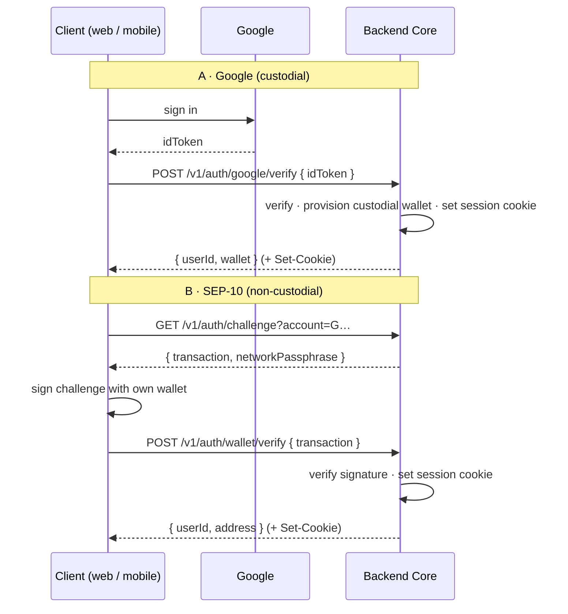

# PathPulse — API Architecture

> The contract between the Backend Core (Aditya) and the Android / iOS / Web clients
> (Daiwik on mobile, Aditya on web). **Both of us follow this doc.** When the API changes,
> this doc and [`packages/contract/openapi.yaml`](../packages/contract/openapi.yaml) change
> **first**, then code.

Related: [ARCHITECTURE.md](ARCHITECTURE.md) (system), [PHASE_PLAN.md](PHASE_PLAN.md) (roadmap/ownership).

> **Stack (current):** monorepo on **pnpm** (`workspace:*` deps). Backend = Node/TS + Express (`pnpm --filter @pathpulse/backend dev`, :8080). Web = **Next.js 16 / React 19 / Tailwind v4**, app-router (`pnpm --dir web dev`, :3000). Auth = **Google sign-in (custodial) + SEP-10 wallet (non-custodial)** — the "Non Custodial" pivot replaced the earlier Privy/`/v1/onboard` model. Privy is **substituted, not deferred**; custody model and signer-backend state are in [`CUSTODY.md`](./CUSTODY.md).

---

## 0. The one rule: contract-first

The single source of truth for the API is **`packages/contract`**:
- `openapi.yaml` — the machine-readable spec (all endpoints, request/response shapes).
- `src/index.ts` — the TypeScript types generated-by-hand-for-now from that spec, imported by backend + web.

**Workflow for any endpoint change (both devs):**
1. Aditya edits `openapi.yaml` + `src/index.ts` on a branch and opens a PR tagged `contract`.
2. Daiwik regenerates the Kotlin/Swift models from `openapi.yaml` (see §9) — never hand-writes request/response models.
3. Backend implements; clients consume. Nobody ships a field that isn't in the contract.

If a client needs a field or endpoint that doesn't exist, the fix is a contract PR, **not** an out-of-band JSON shape. This is what stops Android, iOS, and web from drifting.

---

## 1. Global conventions (memorize these)

| Concern | Rule |
|---|---|
| **Base URL** | `http://localhost:8080` (dev) · staging/prod TBD. Android emulator → `http://10.0.2.2:8080`. iOS sim → `http://localhost:8080`. |
| **Versioning** | All resources under `/v1/…`. `/health` is unversioned. Breaking change ⇒ `/v2`, never a silent shape change. |
| **Format** | JSON only. Request + response bodies are `application/json`. |
| **Casing** | `camelCase` for all JSON keys (matches the TS contract). |
| **Auth** | **httpOnly cookie session** (signed JWT set by the backend). Clients send it automatically — web with `credentials: 'include'`, mobile via a cookie jar. **No `Authorization` header.** Public endpoints: `/health`, `/v1/auth/*`. See §2. |
| **Timestamps** | ISO-8601 UTC, e.g. `2026-07-30T12:00:00Z`. Never epoch, never local time. |
| **Money / amounts** | **Strings**, 7 decimal places (Stellar precision), e.g. `"12.5000000"`. Never floats — floats lose stroops. |
| **Assets** | `{ "code": "USDC", "issuer": "G..." }`. Native XLM = `{ "code": "XLM" }` (no issuer). |
| **Stellar IDs** | account = `G…` (56 chars), tx = 64-hex hash, memo ≤ 28 bytes (text). |
| **Request id** | Client may send `X-Request-Id`; backend echoes it and includes it in errors/logs. |
| **Pagination** | Cursor-based: `?cursor=<opaque>&limit=<n≤100>` → `{ "items": [...], "nextCursor": "…"|null }`. |
| **Idempotency** | POSTs that move value (payouts, tx submit, off-ramp) require `Idempotency-Key: <uuid>`. Same key ⇒ same result, no double-spend. |
| **Rate limits** | `429` with `Retry-After` seconds. Clients back off, never hammer. |

### Standard status codes
`200` ok · `201` created · `202` accepted (async, e.g. batch queued) · `400` validation · `401` missing/invalid token · `403` not allowed · `404` not found · `409` conflict/idempotency replay mismatch · `422` semantically invalid (e.g. insufficient balance) · `429` rate limited · `5xx` server.

### Error envelope (every non-2xx)
```json
{ "error": "InsufficientBalance", "message": "Driver pool balance 3.20 < requested 5.00", "requestId": "req_abc123" }
```
- `error` — stable machine code (switch on this, not the message).
- `message` — human text; may change, don't parse it.
- `requestId` — quote this when reporting a bug.

**Error code catalog** (grows with phases): `ValidationError`, `Unauthorized`, `Forbidden`, `NotFound`, `IdempotencyConflict`, `InsufficientBalance`, `AccountNotFound`, `TrustlineMissing`, `HorizonUnavailable`, `SigningRefused` (mainnet/human-gate), `ExternalDependencyUnavailable` (SDP/Mercuryo sandbox), `RateLimited`, `InternalError`.

---

## 2. Auth model

**Two sign-in methods, one session.** Both set the same **httpOnly cookie** holding a signed JWT
(`{ userId, method, email?, address? }`). Every later request carries that cookie automatically;
`GET /v1/auth/me` reads it, `POST /v1/auth/logout` clears it. There is no `Authorization` header
and no refresh token — a session simply expires and the user signs in again.

The two methods differ in **who holds the key**:

### A. Google sign-in — custodial
1. Client gets a **Google ID token** on-device (Google Identity SDK).
2. `POST /v1/auth/google/verify { idToken }` → backend verifies it (audience = `GOOGLE_CLIENT_ID`),
   extracts the email, and **provisions a backend-custodied Stellar account** for that email
   (Friendbot-funded on testnet). Sets the session cookie (`method: "google"`).
3. Returns `{ userId, wallet }`. Because the backend holds this key, these accounts can use
   **delegated signing** (`/v1/tx/*`, §3).

### B. Wallet connect (SEP-10) — non-custodial
1. `GET /v1/auth/challenge?account=G…` → backend returns a **SEP-10 challenge transaction**
   (built + signed by the server signing key) + `networkPassphrase`.
2. Client signs the challenge with its own wallet (Stellar Wallets Kit — Freighter/Lobstr/…).
3. `POST /v1/auth/wallet/verify { transaction }` → backend verifies the signature (`WebAuth.readChallengeTx`
   + `verifyChallengeTxSigners`), maps the account to a `userId`, sets the session cookie
   (`method: "wallet"`). Returns `{ userId, address }`. The user holds the key; the backend never
   sees it — these users **sign their own transactions client-side** and use `/v1/tx/submit` (§3).

> Current state: sessions + both flows are **live**. The signing key for SEP-10 challenges comes from
> `SEP10_SIGNING_SECRET` (an ephemeral dev key if unset). Custodial and non-custodial users are
> distinguished by `session.method`; per-endpoint enforcement of the session is being rolled out
> as protected routes land.



---

## 3. Delegated signing model (how clients move value)

Clients **never** hold treasury/protocol keys and never build settlement transactions. Two paths, by custody:

- **Custodial (Google) accounts** → `POST /v1/tx/build` constructs the transaction and **delegate-signs** it (the backend holds that key), returning base64 **XDR** + hash; then `POST /v1/tx/submit`. **`/v1/tx/build` requires a session** and takes the signing identity from it — a `userId` in the body is ignored.
- **Non-custodial (SEP-10 wallet) users** → the backend builds/returns an unsigned XDR (or the client builds its own), the **user signs client-side** with their wallet, then `POST /v1/tx/submit` relays the signed envelope to Horizon.

`POST /v1/tx/submit` returns `{ hash, successful, ledger, horizonUrl }`.

```mermaid
sequenceDiagram
  participant App as Client
  participant API as Backend Core
  participant HZ as Horizon
  App->>API: POST /v1/tx/build { operations[] } + session cookie  (Idempotency-Key)
  API->>API: build tx; delegate-sign (managed) OR return unsigned XDR
  API-->>App: { xdr, hash }
  App->>API: POST /v1/tx/submit { xdr }  (Idempotency-Key)
  API->>HZ: submit
  HZ-->>API: result
  API-->>App: { hash, successful, ledger, horizonUrl }
```

Guardrails baked into the backend: the signer **refuses mainnet** unless a KMS/HSM backend is configured, and treasury/mainnet actions are **human-gated** (no auto-signing). See [ARCHITECTURE.md](ARCHITECTURE.md) §human gates.

---

## 4. Endpoint catalog by phase

Legend: **[live]** implemented on testnet · **[planned]** contract-defined, not yet built · owner in parens.

### Phase 1 — Foundation & auth (D1)
| Method | Path | Purpose | Status |
|---|---|---|---|
| GET | `/health` | liveness + network/version | **[live]** |
| GET | `/v1/accounts/distribution` | Partner Revenue / Driver Pool / Treasury accounts | **[live]** |
| GET | `/v1/treasury/config` | multisig signers + thresholds | **[live]** |
| POST | `/v1/auth/google/verify` | Google ID token → custodial wallet + session | **[live]** |
| GET | `/v1/auth/challenge` | SEP-10 challenge for a Stellar account | **[live]** |
| POST | `/v1/auth/wallet/verify` | verify signed SEP-10 challenge → session | **[live]** |
| GET | `/v1/auth/me` | current session user (or `null`) | **[live]** |
| POST | `/v1/auth/logout` | clear the session cookie | **[live]** |
| POST | `/v1/tx/build` | build (+delegate-sign) a tx — **session required** | **[live]** |
| POST | `/v1/tx/submit` | submit signed XDR to Horizon (relay; no session) | **[live]** |
| GET | `/v1/wallets/me` | the caller's wallet + balances | **[planned]** |

### Phase 2 — Wallet interop & payout rails (D2, D3)
| Method | Path | Purpose |
|---|---|---|
| GET | `/v1/wallets/me/balances` | reward balances (Horizon/API-backed) — mobile reward screens |
| GET | `/v1/payouts?cursor=&limit=` | driver's payout history |
| GET | `/v1/payouts/{payoutId}` | single payout detail |
| POST | `/v1/devices` | register push token (APNs/FCM) for payout notifications |
| POST | `/v1/ops/payouts/batches` | create SDP batch payout *(ops)* |
| GET | `/v1/ops/payouts/batches/{id}` | batch status + reconciliation *(ops)* |
| POST | `/v1/wallets/sessions` | external-wallet connection session (Wallets Kit) |

### Phase 3 — Off-ramp & liquidity (D4, D5)
| Method | Path | Purpose |
|---|---|---|
| POST | `/v1/offramp/sessions` | start Mercuryo SEP-24 interactive withdrawal → hosted webview URL |
| GET | `/v1/offramp/sessions/{id}` | withdrawal status + receipt, linked to settlement batch |
| GET | `/v1/offramp/quotes?from=&to=&amount=` | conversion quote |
| GET | `/v1/routing/assets` | assets routable through Aquarius on this network **[live]** |
| GET | `/v1/routing/quote` | Aquarius path-payment quote (XLM ⇄ USDC, testnet) **[live]** |
| POST | `/v1/routing/swap` | execute the quoted route through the Aquarius router contract **[live]** |

### Phase 4 — Settlement engine & SCOUT (D6)
| Method | Path | Purpose | Status |
|---|---|---|---|
| POST | `/v1/settlement/batches` | execute a deterministic 50/30/20 batch | **[live]** |
| GET | `/v1/settlement/batches?cursor=&limit=` | settlement batches (indexer v1, in-memory) | **[live]** |
| GET | `/v1/settlement/batches/{id}` | drill-down: Source → 50/30/20 split → driver | **[live]** |
| GET | `/v1/scout/me` | caller's SCOUT tier + multiplier (1.0/1.2/1.5x) | **[planned]** |
| GET | `/v1/settlement/me?cursor=&limit=` | driver's earnings breakdown per batch (mobile) | **[planned]** |

### Phase 6 — Government gateway & exports (D8)
| Method | Path | Purpose |
|---|---|---|
| GET | `/v1/gov/settlements` | partner-scoped settlement traceability *(partner auth)* |
| GET | `/v1/gov/settlements/{id}/audit` | on-chain audit trail |
| GET | `/v1/gov/exports?format=csv\|pdf&from=&to=` | compliance export |

> Paths are the agreed shape. Each becomes real only via a contract PR that adds it to `openapi.yaml` with full request/response schemas before implementation.

---

## 5. Realtime (WebSocket)

For payout-received and settlement events, clients subscribe instead of polling.

- Endpoint: `GET /v1/stream` (WebSocket upgrade), authenticated by the **session cookie** sent on the upgrade request.
- Subscribe frame: `{ "type": "subscribe", "channels": ["payouts:me", "settlement:me"] }`.
- Event frame: `{ "type": "event", "channel": "payouts:me", "data": { …Payout } }`.
- Heartbeat: server ping every 30s; client replies pong. Reconnect with exponential backoff; on reconnect, clients re-fetch via REST to fill any gap (WS is a notification, REST is the source of truth).

Mobile uses WS only for live nudges (badge a new payout, then GET the detail). Never treat a WS event as authoritative state on its own.

---

## 6. Core data shapes (from `packages/contract`)

These live in `src/index.ts`; later phases extend the same file.

```ts
type StellarNetwork = 'testnet' | 'mainnet';
type DistributionAccountRole = 'partner_revenue' | 'driver_pool' | 'treasury';

interface ManagedWallet { userId: string; address: string; provisioned: boolean; network: StellarNetwork; }
interface AssetRef { code: string; issuer?: string; }               // no issuer = native XLM

// auth (cookie session)
interface SessionUser { userId: string; method: 'google' | 'wallet'; email?: string; address?: string; }
interface AuthMeResponse { user: SessionUser | null; }
interface GoogleVerifyRequest { idToken: string; }
interface GoogleVerifyResponse { userId: string; wallet: ManagedWallet; }
interface WalletChallengeResponse { transaction: string; networkPassphrase: string; } // SEP-10 challenge XDR
interface WalletVerifyRequest { transaction: string; }                                 // signed challenge
interface WalletVerifyResponse { userId: string; address: string; }

// delegated signing
interface BuildTransactionRequest { userId: string; operations: TransactionOperation[]; memo?: string; }
interface BuildTransactionResponse { xdr: string; hash: string; }
interface SubmitTransactionResponse { hash: string; successful: boolean; ledger?: number; horizonUrl: string; }

// settlement (D6)
type ScoutTier = 1 | 2 | 3;
const SCOUT_MULTIPLIER: Record<ScoutTier, number>;                   // 1→1.0, 2→1.2, 3→1.5
interface CreateSettlementBatchRequest { grossAmount: string; asset?: AssetRef; drivers: SettlementDriverInput[]; }
interface SettlementSplit { authorities: string; driverRewards: string; treasury: string; } // 50/30/20
interface SettlementBatch { id: string; createdAt: string; grossAmount: string; split: SettlementSplit;
  driverPayouts: SettlementDriverPayout[]; sourceAddress: string; txHash: string; horizonUrl: string; /* … */ }
interface SettlementBatchPage { items: SettlementBatch[]; nextCursor: string | null; }

interface ApiError { error: string; message: string; requestId?: string; }
```

Planned additions (Phase 2+): `Balance`, `Payout`, `OfframpSession`, and a generic `Page<T>`.

---

## 7. Environments

| Env | Base URL | Network | Notes |
|---|---|---|---|
| Local | `http://localhost:8080` | testnet | backend `pnpm --filter @pathpulse/backend dev`; web `pnpm --dir web dev` (Next.js :3000). Android emulator uses `10.0.2.2`. |
| Staging | TBD | testnet | shared testnet backend for reviewers |
| Prod | TBD | mainnet | Phase 5+, human-gated |

Clients read the base URL from config (never hardcode): web `NEXT_PUBLIC_API_URL`, Android `BuildConfig.API_BASE`, iOS `Info.plist`/xcconfig.

**Cookie/CORS:** the session is an httpOnly cookie, so cross-origin clients must send credentials (web `fetch(..., { credentials: 'include' })`) and the backend must allow that origin with `Access-Control-Allow-Credentials`. The cookie is `SameSite=Lax`, `Secure` in production.

---

## 8. Non-negotiables for both devs

- **Contract-first**: no field ships that isn't in `openapi.yaml`. Client models are generated, not hand-written.
- **Money is strings, 7 decimals.** Never parse Stellar amounts into a float/double anywhere.
- **Session is a cookie, not a header.** Send `credentials: 'include'`; never put session/secrets in URLs or query strings.
- **Custody boundary:** the backend delegate-signs only for **custodial (Google)** accounts, and only for the account named by the caller's own session; **non-custodial (SEP-10 wallet)** users sign client-side. Clients never sign settlement/treasury tx. Custodial keys are in-memory and do not survive a redeploy — see [`CUSTODY.md`](./CUSTODY.md).
- **Idempotency-Key on every value-moving POST** (target convention). Retries must not double-pay.
- **Switch on `error` codes, not messages.** Handle `401` → re-authenticate (no refresh token), `429` → back off, `422` → show the reason.
- **Testnet only through Phase 4.** No client hardcodes a mainnet URL before Phase 5.

---

## 9. Generating client models from the contract

Both mobile targets generate models from `packages/contract/openapi.yaml` — keep generated code in a separate folder from hand-written UI so regen never clobbers your work.

- **Kotlin**: `openapi-generator generate -i packages/contract/openapi.yaml -g kotlin -o android/app/src/generated`
- **Swift**: swift-openapi-generator (SPM plugin) against `packages/contract/openapi.yaml`
- **TS (web/backend)**: import types directly from `@pathpulse/contract` (no codegen needed).

Regenerate whenever a `contract`-tagged PR lands. If generated types stop matching the backend, that's a contract bug — fix the spec, don't patch the client.
```
