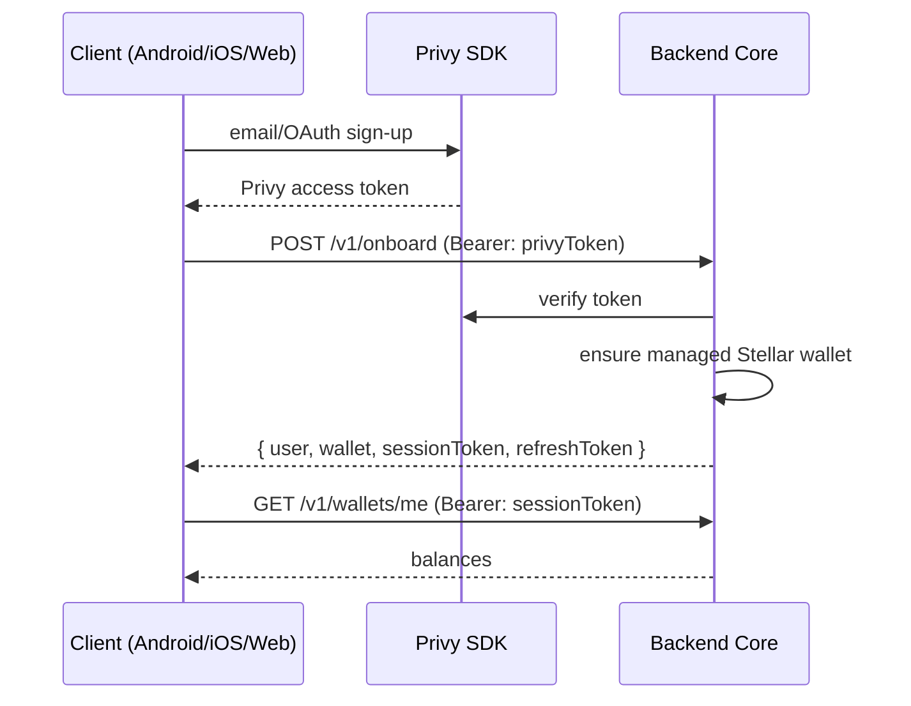

# PathPulse — API Architecture

> The contract between the Backend Core (Aditya) and the Android / iOS / Web clients
> (Daiwik on mobile, Aditya on web). **Both of us follow this doc.** When the API changes,
> this doc and [`packages/contract/openapi.yaml`](../packages/contract/openapi.yaml) change
> **first**, then code.

Related: [ARCHITECTURE.md](ARCHITECTURE.md) (system), [PHASE_PLAN.md](PHASE_PLAN.md) (roadmap/ownership).

---

## 0. The one rule: contract-first

The single source of truth for the API is **`packages/contract`**:
- `openapi.yaml` — the machine-readable spec (all endpoints, request/response shapes).
- `src/index.ts` — the TypeScript types generated-by-hand-for-now from that spec, imported by backend + web.

**Workflow for any endpoint change (both devs):**
1. Aditya edits `openapi.yaml` + `src/index.ts` on a branch and opens a PR tagged `contract`.
2. Daiwik regenerates the Kotlin/Swift models from `openapi.yaml` (see §9) — never hand-writes request/response models.
3. Backend implements; clients consume. Nobody ships a field that isn't in the contract.

If a client needs a field or endpoint that doesn't exist, the fix is a contract PR, **not** an out-of-band JSON shape. This is what stops Android, iOS, and web from drifting.

---

## 1. Global conventions (memorize these)

| Concern | Rule |
|---|---|
| **Base URL** | `http://localhost:8080` (dev) · staging/prod TBD. Android emulator → `http://10.0.2.2:8080`. iOS sim → `http://localhost:8080`. |
| **Versioning** | All resources under `/v1/…`. `/health` is unversioned. Breaking change ⇒ `/v2`, never a silent shape change. |
| **Format** | JSON only. Request + response bodies are `application/json`. |
| **Casing** | `camelCase` for all JSON keys (matches the TS contract). |
| **Auth** | `Authorization: Bearer <token>` on every `/v1` endpoint except `/v1/onboard`. See §2. |
| **Timestamps** | ISO-8601 UTC, e.g. `2026-07-30T12:00:00Z`. Never epoch, never local time. |
| **Money / amounts** | **Strings**, 7 decimal places (Stellar precision), e.g. `"12.5000000"`. Never floats — floats lose stroops. |
| **Assets** | `{ "code": "USDC", "issuer": "G..." }`. Native XLM = `{ "code": "XLM" }` (no issuer). |
| **Stellar IDs** | account = `G…` (56 chars), tx = 64-hex hash, memo ≤ 28 bytes (text). |
| **Request id** | Client may send `X-Request-Id`; backend echoes it and includes it in errors/logs. |
| **Pagination** | Cursor-based: `?cursor=<opaque>&limit=<n≤100>` → `{ "items": [...], "nextCursor": "…"|null }`. |
| **Idempotency** | POSTs that move value (payouts, tx submit, off-ramp) require `Idempotency-Key: <uuid>`. Same key ⇒ same result, no double-spend. |
| **Rate limits** | `429` with `Retry-After` seconds. Clients back off, never hammer. |

### Standard status codes
`200` ok · `201` created · `202` accepted (async, e.g. batch queued) · `400` validation · `401` missing/invalid token · `403` not allowed · `404` not found · `409` conflict/idempotency replay mismatch · `422` semantically invalid (e.g. insufficient balance) · `429` rate limited · `5xx` server.

### Error envelope (every non-2xx)
```json
{ "error": "InsufficientBalance", "message": "Driver pool balance 3.20 < requested 5.00", "requestId": "req_abc123" }
```
- `error` — stable machine code (switch on this, not the message).
- `message` — human text; may change, don't parse it.
- `requestId` — quote this when reporting a bug.

**Error code catalog** (grows with phases): `ValidationError`, `Unauthorized`, `Forbidden`, `NotFound`, `IdempotencyConflict`, `InsufficientBalance`, `AccountNotFound`, `TrustlineMissing`, `HorizonUnavailable`, `SigningRefused` (mainnet/human-gate), `ExternalDependencyUnavailable` (SDP/Mercuryo sandbox), `RateLimited`, `InternalError`.

---

## 2. Auth model

Two audiences, two token types. Both arrive as `Authorization: Bearer <token>`.

### Driver apps (Android / iOS / web driver flows)
1. Client signs the user up **on-device** via the Privy SDK (email/OAuth) → gets a **Privy access token**.
2. Client calls `POST /v1/onboard` with that token. Backend verifies it with Privy, ensures the managed Stellar wallet exists, and returns the user + a **PathPulse session token** (short-lived JWT) + refresh token.
3. Client stores the session token (Android: EncryptedSharedPreferences · iOS: Keychain · web: httpOnly cookie or memory) and sends it as `Bearer` on all later calls.
4. On `401`, client calls `POST /v1/auth/refresh` with the refresh token; if that fails, re-run onboarding.

> Phase-1 note: the current backend `/v1/onboard` accepts the Privy token and returns `{ userId, wallet }` with a dev stub. The session-token issuance + `/v1/auth/refresh` land as we wire live Privy. Build clients against the **session-token** model now; treat the Phase-1 stub as transitional.

### Ops console (web, internal)
Separate realm. Operators authenticate at `POST /v1/ops/login` → ops session. Never mixed with driver tokens. (Phase-1 web ships a dev-passcode gate; backend `/v1/ops/login` replaces it in Phase 2.)



---

## 3. Delegated signing model (how clients move value)

Clients **never** hold treasury/protocol keys and never build settlement transactions. For actions from the driver's own managed wallet, the backend builds and (for managed accounts) signs; the client only initiates and, where required, confirms.

- `POST /v1/tx/build` → backend constructs the transaction (and delegate-signs if it's a managed account), returns base64 **XDR** + hash.
- `POST /v1/tx/submit` → backend submits the (signed) XDR to Horizon, returns result + explorer URL.

External wallets (web, via Stellar Wallets Kit) sign client-side and submit their own signed XDR through `/v1/tx/submit`.

```mermaid
sequenceDiagram
  participant App as Client
  participant API as Backend Core
  participant HZ as Horizon
  App->>API: POST /v1/tx/build { userId, operations[] }  (Idempotency-Key)
  API->>API: build tx; delegate-sign (managed) OR return unsigned XDR
  API-->>App: { xdr, hash }
  App->>API: POST /v1/tx/submit { xdr }  (Idempotency-Key)
  API->>HZ: submit
  HZ-->>API: result
  API-->>App: { hash, successful, ledger, horizonUrl }
```

Guardrails baked into the backend: the signer **refuses mainnet** unless a KMS/HSM backend is configured, and treasury/mainnet actions are **human-gated** (no auto-signing). See [ARCHITECTURE.md](ARCHITECTURE.md) §human gates.

---

## 4. Endpoint catalog by phase

Legend: **[live]** implemented on testnet · **[planned]** contract-defined, not yet built · owner in parens.

### Phase 1 — Foundation (D1)
| Method | Path | Purpose | Status |
|---|---|---|---|
| GET | `/health` | liveness + network/version | **[live]** (Aditya) |
| GET | `/v1/accounts/distribution` | Partner Revenue / Driver Pool / Treasury accounts | **[live]** |
| GET | `/v1/treasury/config` | multisig signers + thresholds | **[live]** |
| POST | `/v1/onboard` | Privy token → managed wallet (+ session) | **[live]** (stub) |
| POST | `/v1/tx/build` | build (+delegate-sign) a tx | **[planned]** |
| POST | `/v1/tx/submit` | submit signed XDR to Horizon | **[planned]** |
| GET | `/v1/wallets/me` | the caller's wallet + balances | **[planned]** |
| POST | `/v1/auth/refresh` | refresh session token | **[planned]** |

### Phase 2 — Wallet interop & payout rails (D2, D3)
| Method | Path | Purpose |
|---|---|---|
| GET | `/v1/wallets/me/balances` | reward balances (Horizon/API-backed) — mobile reward screens |
| GET | `/v1/payouts?cursor=&limit=` | driver's payout history |
| GET | `/v1/payouts/{payoutId}` | single payout detail |
| POST | `/v1/devices` | register push token (APNs/FCM) for payout notifications |
| POST | `/v1/ops/payouts/batches` | create SDP batch payout *(ops)* |
| GET | `/v1/ops/payouts/batches/{id}` | batch status + reconciliation *(ops)* |
| POST | `/v1/wallets/sessions` | external-wallet connection session (Wallets Kit) |

### Phase 3 — Off-ramp & liquidity (D4, D5)
| Method | Path | Purpose |
|---|---|---|
| POST | `/v1/offramp/sessions` | start Mercuryo SEP-24 interactive withdrawal → hosted webview URL |
| GET | `/v1/offramp/sessions/{id}` | withdrawal status + receipt, linked to settlement batch |
| GET | `/v1/offramp/quotes?from=&to=&amount=` | conversion quote |
| GET | `/v1/routing/quote` | Stellar Broker / Aquarius path-payment quote *(internal/ops)* |

### Phase 4 — Settlement engine & SCOUT (D6)
| Method | Path | Purpose |
|---|---|---|
| GET | `/v1/settlement/batches?cursor=&limit=` | settlement batches |
| GET | `/v1/settlement/batches/{id}` | drill-down: Treasury → 50/30/20 split → SDP → driver |
| GET | `/v1/scout/me` | caller's SCOUT tier + multiplier (1.0/1.2/1.5x) |
| GET | `/v1/settlement/me?cursor=&limit=` | driver's earnings breakdown per batch (mobile) |

### Phase 6 — Government gateway & exports (D8)
| Method | Path | Purpose |
|---|---|---|
| GET | `/v1/gov/settlements` | partner-scoped settlement traceability *(partner auth)* |
| GET | `/v1/gov/settlements/{id}/audit` | on-chain audit trail |
| GET | `/v1/gov/exports?format=csv\|pdf&from=&to=` | compliance export |

> Paths are the agreed shape. Each becomes real only via a contract PR that adds it to `openapi.yaml` with full request/response schemas before implementation.

---

## 5. Realtime (WebSocket)

For payout-received and settlement events, clients subscribe instead of polling.

- Endpoint: `GET /v1/stream` (WebSocket upgrade), `Authorization: Bearer <sessionToken>`.
- Subscribe frame: `{ "type": "subscribe", "channels": ["payouts:me", "settlement:me"] }`.
- Event frame: `{ "type": "event", "channel": "payouts:me", "data": { …Payout } }`.
- Heartbeat: server ping every 30s; client replies pong. Reconnect with exponential backoff; on reconnect, clients re-fetch via REST to fill any gap (WS is a notification, REST is the source of truth).

Mobile uses WS only for live nudges (badge a new payout, then GET the detail). Never treat a WS event as authoritative state on its own.

---

## 6. Core data shapes (from `packages/contract`)

These already exist in `src/index.ts`; later phases extend the same file.

```ts
type StellarNetwork = 'testnet' | 'mainnet';
type DistributionAccountRole = 'partner_revenue' | 'driver_pool' | 'treasury';

interface ManagedWallet { userId: string; address: string; provisioned: boolean; network: StellarNetwork; }
interface AssetRef { code: string; issuer?: string; }               // no issuer = native XLM
interface OnboardResponse { userId: string; wallet: ManagedWallet; } // + sessionToken (planned)

// delegated signing
interface BuildTransactionRequest { userId: string; operations: TransactionOperation[]; memo?: string; }
interface BuildTransactionResponse { xdr: string; hash: string; }
interface SubmitTransactionResponse { hash: string; successful: boolean; ledger?: number; horizonUrl: string; }

interface ApiError { error: string; message: string; requestId?: string; }
```

Planned additions (Phase 2+): `Balance { asset: AssetRef; amount: string }`, `Payout`, `SettlementBatch`, `ScoutTier`, `OfframpSession`, `Page<T> { items: T[]; nextCursor: string | null }`.

---

## 7. Environments

| Env | Base URL | Network | Notes |
|---|---|---|---|
| Local | `http://localhost:8080` | testnet | `npm run dev:backend`. Android emulator uses `10.0.2.2`. |
| Staging | TBD | testnet | shared testnet backend for reviewers |
| Prod | TBD | mainnet | Phase 5+, human-gated |

Clients read the base URL from config (never hardcode): Android `BuildConfig.API_BASE`, iOS `Info.plist`/xcconfig, web `VITE_API_BASE`.

---

## 8. Non-negotiables for both devs

- **Contract-first**: no field ships that isn't in `openapi.yaml`. Client models are generated, not hand-written.
- **Money is strings, 7 decimals.** Never parse Stellar amounts into a float/double anywhere.
- **Never put secrets or tokens in URLs/query strings.** Tokens go in the `Authorization` header only.
- **Idempotency-Key on every value-moving POST.** Retries must not double-pay.
- **Clients never sign settlement/treasury tx.** Only the driver's own managed-wallet ops via `/v1/tx/*`.
- **Switch on `error` codes, not messages.** Handle `401` → refresh, `429` → back off, `422` → show the reason.
- **Testnet only through Phase 4.** No client hardcodes a mainnet URL before Phase 5.

---

## 9. Generating client models from the contract

Both mobile targets generate models from `packages/contract/openapi.yaml` — keep generated code in a separate folder from hand-written UI so regen never clobbers your work.

- **Kotlin**: `openapi-generator generate -i packages/contract/openapi.yaml -g kotlin -o android/app/src/generated`
- **Swift**: swift-openapi-generator (SPM plugin) against `packages/contract/openapi.yaml`
- **TS (web/backend)**: import types directly from `@pathpulse/contract` (no codegen needed).

Regenerate whenever a `contract`-tagged PR lands. If generated types stop matching the backend, that's a contract bug — fix the spec, don't patch the client.
```
